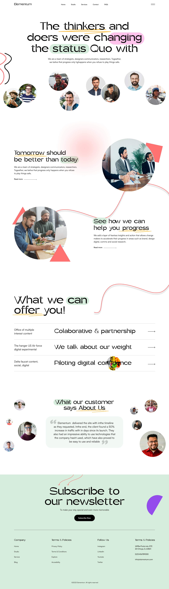
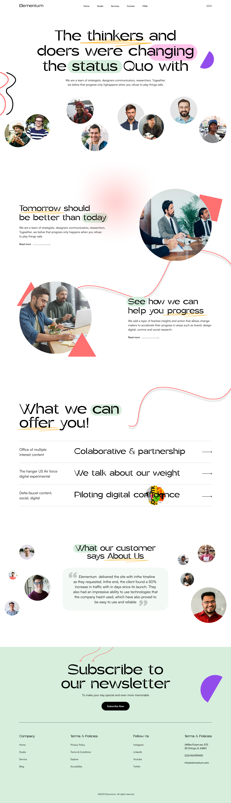

# Elementum — Figma to Code Implementation

<p align="center">
  
</p>

This project is a high-fidelity **Figma to Code** web implementation of the Elementum desktop website design. Built using React, Vite, and Tailwind CSS, it prioritizes pixel-perfect layout replication, typography alignment, and visual styling matching the original Figma artboard.

> 💻 **Best Viewed on Laptop/Desktop**: The layout is engineered to match a locked 1920px Figma canvas. For the most premium visual fidelity, we recommend opening this page in a laptop or desktop browser.

---

## 🔗 Links & Resources

*   **Live Preview**: [Elementum Production Preview](https://elementum-figma-to-code-p6y6bheuc-johan-andrews12.vercel.app/)
*   **Figma Design Artboard**: [Figma Assignment Design](https://www.figma.com/design/0K35IOZ4Qwqur0b9o2PXlN/Assignment?node-id=1-79&t=sMHlG3gsuxw8BIE9-0)

---

## 📸 Visual Previews

### 💻 Implemented Website Screenshot


### 🎨 Reference Figma Design


---

## 🛠️ Tech Stack & Key Features

*   **Core Framework**: [React 19](https://react.dev/) + [Vite](https://vite.dev/) for fast hot-module replacement (HMR) and optimized builds.
*   **Styling & Layout**: [Tailwind CSS](https://tailwindcss.com/) for layout structure, responsive variants, and custom styles.
*   **SVG Graphics**: Custom SVG paths are utilized to render precise decorative underlines, wavy section dividers, skewed borders, and arrows to match Figma assets exactly.
*   **Proportional Scaling**: Elements are positioned using absolute pixel layouts based on a standard `1920px` artboard, ensuring faithful alignment with Figma's viewport coordinates.

---

## 📁 Project Structure

Below is a brief summary of the workspace architecture:

```bash
figma-website/
├── src/
│   ├── assets/             # Assets and images (collages, photos, backgrounds)
│   │   ├── images/         # Circular cropped portraits and sticker assets (like rect 661)
│   │   └── hero.png        # Hero section graphic assets
│   ├── components/
│   │   ├── layout/         # General layout containers
│   │   │   └── Container.jsx
│   │   └── sections/       # Modular page sections
│   │       ├── HeroSection.jsx         # Hero layout, custom purple semicircle, and hand-drawn highlights
│   │       ├── AboutSection1.jsx       # About column, rotated accent shapes, and connecting SVG wave
│   │       ├── AboutSection2.jsx       # About continuation, unrotated background shapes, and text alignment
│   │       ├── ServicesSection.jsx      # Services grid, SVG arrows, and custom Rectangle 661 sticker
│   │       ├── TestimonialsSection.jsx  # Testimonials quote block and custom capsule double quotes
│   │       ├── NewsletterSection.jsx    # Newsletter capture, clipped circle, and red frame overlays
│   │       └── Footer.jsx              # Footer copyright and links
│   ├── data/
│   │   └── content.js      # Centralized static text content and data configs
│   ├── App.jsx             # Main site structure coordinator
│   ├── index.css           # Global stylesheet and Tailwind custom classes
│   └── main.jsx            # DOM mounting entrypoint
├── package.json
└── vite.config.js
```

---

## 🚀 Development & Commands

Run the local development server:
```bash
npm run dev
```

Build the application for production:
```bash
npm run build
```

Preview the production build locally:
```bash
npm run preview
```
